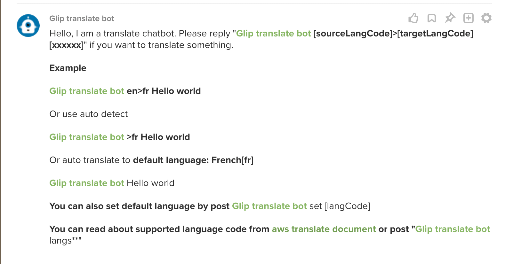

# ringcentral-translate-bot

Translate bot for RingCentral Glip



## Prerequisites$

- Python3.6+ and Pip3
- Get an AWS account, create `aws_access_key_id` and `aws_secret_access_key` and place them in `~/.aws/credentials`, like this:

```bash
[default]
aws_access_key_id = <your aws_access_key_id>
aws_secret_access_key = <your aws_secret_access_key>
```

- Create the bot App: Login to [developer.ringcentral.com](https://developer.ringcentral.com) and create an `public` `Server/Bot` app with permissions: `ReadAccounts, Edit Extensions, WebhookSubscriptions, Glip`(or more as you may need)

## Development & Quick start

```bash

# use virtualenv
pip3 install virtualenv # might need sudo

# init virtual env
virtualenv venv --python=python3

# use env
source ./venv/bin/activate

# install required modules
pip install -r requirements.txt

# run ngrok proxy
# since bot need https server,
# so we need a https proxy for ringcentral to visit our local server
./bin/proxy
# will show:
# Forwarding https://xxxxx.ngrok.io -> localhost:9890

# create env file
# .env already created from .sample.env
# just edit .env, set proper setting,
RINGCENTRAL_BOT_SERVER=https://xxxxx.ngrok.io

## for bots auth required, get them from your ringcentral app page
RINGCENTRAL_BOT_CLIENT_ID=
RINGCENTRAL_BOT_CLIENT_SECRET=

# and goto your ringcentral app setting page, set OAuth Redirect URI to https://https://xxxxx.ngrok.io/bot-oauth

# create bot config
cp bot-logic.py config.py

# run local dev server
./bin/start
```

## Test bot

- Goto your ringcentral app's bot section, click 'Add to glip'
- Login to [https://glip-app.devtest.ringcentral.com](https://glip-app.devtest.ringcentral.com), find the bot by searching its name. Talk to the bot.
- Edit config.py to change bot bahavior and test in [https://glip-app.devtest.ringcentral.com](https://glip-app.devtest.ringcentral.com)

## Building and Deploying to AWS Lambda

[deploy-to-aws-lambda](https://github.com/zxdong262/ringcentral-chatbot-python/blob/master/docs/deploy-to-aws-lambda.md)

## License

MIT
